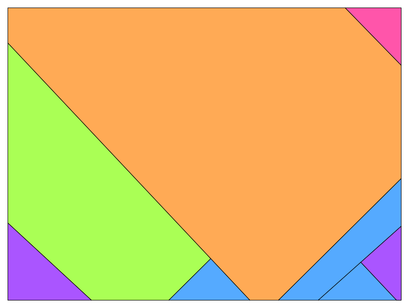

# The Stijl


Software that creates a canvas with colourful planes which is inspired by De Stijl art movement. 

Where De Stijl had right angles and bright primary colours however this software will make all angles slightly malformed. The angles will be 88, 89, 91 or 92 degrees instead of the straight 90 degree angles. Also, the colouring will not be the primary colours but the tertiary colour scheme. The resulting canvas will be a collection of planes that are all slightly crooked and coloured with the tertiary colouring schemes.

An example is shown below. 


The algorithm works by drawing a large square at a 45-degree angle behind the canvas. It will then execute the following steps   
- Pick one of the plane currently available in the square (in the beginning this is 1). 
- Select 1 of the 4 lines from that plane.
- select a random point on this line between 0 and the length of the line.
- Determine an angle (88, 89, 91, 92).
- use this angle to calculate the 2 oblique triangles to find the point on the other side.
- Draw a line through the plane at that angle to split up the plane in 2 planes.
- Check if the plane is valid.
  - All angles that are created are not 90-degree.
  - All the lines that will be drawn are not too small.
- If the plane is valid, then draw the plane with a random colour from the list of tertiary colours.
- If the plane is invalid ignore and start from the beginning.

These steps are executed based on the amount of planes it should draw. This value is a randomly determined value between `min_squares` and `max_squares` 

An example of the algorithm is show in the gif below. This is created using the command:
```commandline
python stijl.py --seed="The Stijl" --width=800 --height=800 --min_squares=0 --max_squares=20 --view_algorithm=True
```


--seed SEED           The seed of the artwork (default 'The Stijl')
  --width WIDTH         The width of the canvas (default: 800)
  --height HEIGHT       The width of the canvas (default: 600)
  --min_squares MIN_SQUARES
                        It will draw a random amount of squares based on the seed between `min_squares` and
                        `max_squares`. The `min_squares` is the minimal amount of squares (default:0)
  --max_squares MAX_SQUARES
                        It will draw a random amount of squares based on the seed between `min_squares` and
                        `max_squares`. The `max_squares` is the maximum amount of squares (default:20)
  --view_algorithm VIEW_ALGORITHM
                        If True the canvas will expand and you can see the algorithm perform it's steps. If set to
                        False the algorithm will finish as quick as possible and store images of the final canvas
