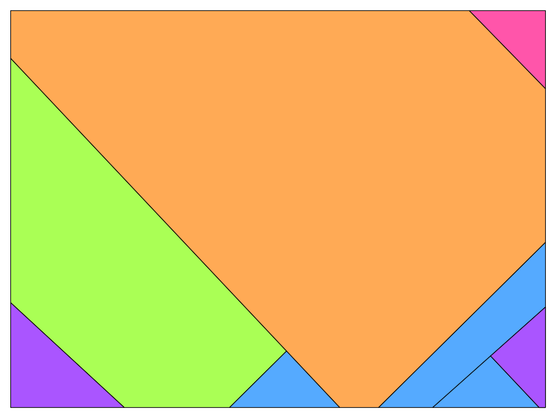
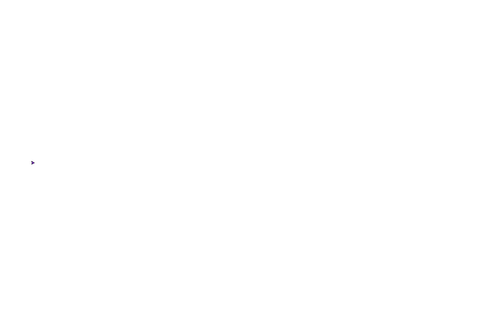
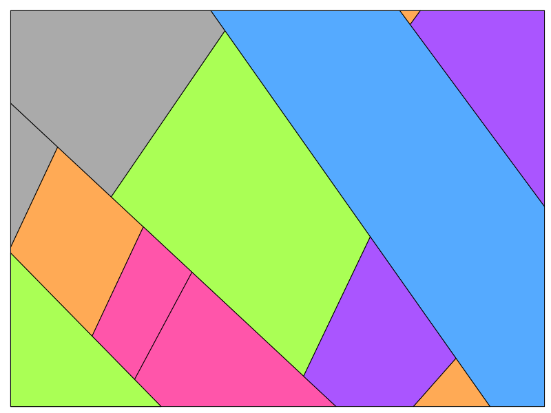
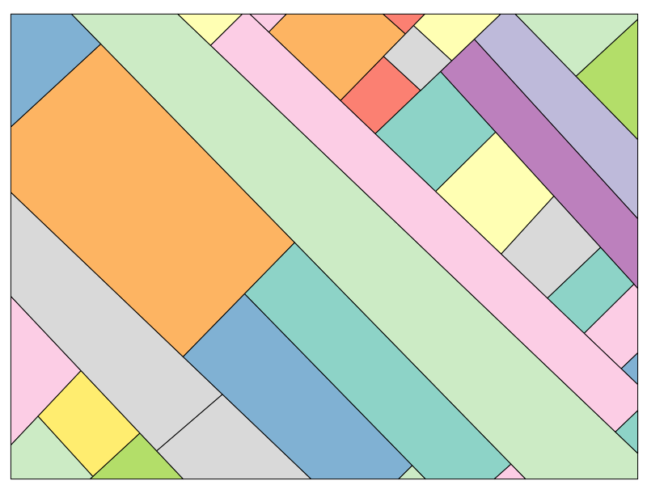

# The Stijl


Software that creates a canvas with colourful planes which is inspired by De Stijl art movement. 

Where De Stijl had right angles and bright primary colours however this software will make all angles slightly malformed. The angles will be 88, 89, 91 or 92 degrees instead of the straight 90 degree angles. Also, the colouring will not be the primary colours but the tertiary colour scheme. The resulting canvas will be a collection of planes that are all slightly crooked and coloured with the tertiary colouring schemes.

An example is shown below. 


The algorithm works by drawing a large square at a 45-degree angle behind the canvas. It will then execute the following steps   
- Pick one of the plane currently available in the square (in the beginning this is 1). 
- Select 1 of the 4 lines from that plane.
- select a random point on this line between 0 and the length of the line.
- Determine an angle (88, 89, 91, 92).
- use this angle to calculate the 2 oblique triangles to find the point on the other side.
- Draw a line through the plane at that angle to split up the plane in 2 planes.
- Check if the plane is valid.
  - All angles that are created are not 90-degree.
  - All the lines that will be drawn are not too small.
- If the plane is valid, then draw the plane with a random colour from the list of tertiary colours.
- If the plane is invalid ignore and start from the beginning.

These steps are executed based on the amount of planes it should draw. This value is a randomly determined value between `min_squares` and `max_squares` 

An example of the algorithm is show in the gif below. This is created using the command:
```commandline
python stijl.py --seed="The Stijl" --width=800 --height=600 --min_squares=0 --max_squares=20 --view_algorithm=True
```

The values given as arguments are also the default values. So the same result is given by just running `stijl.py`

You can also pass a list of angles as numbers. These are used to create the angles of the planes. By setting these to be just not 90 degrees you'll create almost square looking planes but they would seem slightly off and crooked. The default of these values are `"88, 89, 91, 92"`.
As an example, the following image is created using the command:
```commandline
python stijl.py --angles="69, 31, 72"
```


The colouring scheme is chosen to be the tertiary colours using paint. So it uses the CYMK colouring. The reason that the tertiary is default and not secondary is because the secondary colours of the CYMK model are basically the primary colours of the RGB computer monitors colour scheme and it would not give many options. The tertiary colours are all the colours with a 2:1 ratio of the primary colours (cyan, magenta and yellow).

Including a light and dark grey this gives the following options:
- Malibu 2: #55AAFF
- Heliotrope: #AA55FF
- Aquamarine: #55FFAA
- Green Yellow: #AAFF55
- Heliotrope: #AA55FF
- Hot Pink: #FF55AA
- Texas Rose: #FFAA55
- Emperor: #555555
- Silver Chalice: #AAAAAA

These hex options are defined in the `colours` variable found in `util/colours.py`. If you want to change the colouring scheme that the software will choose from you can change this variable to include hex strings of your own chosen colouring scheme. For instance, we can change the variable to the following:
```
colours = ["#8dd3c7", "#ffffb3", "#bebada", "#fb8072", "#80b1d3", "#fdb462", "#b3de69", "#fccde5", "#d9d9d9", "#bc80bd", "#ccebc5", "#ffed6f",]
```
This colouring scheme (chosen using https://colorbrewer2.org) can produce the following result:


Whenever you execute the application using a seed it will create a 'result' folder where the application is located. In this folder it will create a another folder of the chosen seed and within that folder it will have the final image that was created in eps file format with an image for every separate plane. 

There will also be a `plane_info.txt` file in this folder. In this file it will list all the coordinates points of the planes in the final images within your chosen canvas width and height, [0, 0] being the bottom left and [width, height] top right, with the colour in hex format. The plane indexing in this file will be the same as the images in the folder. This information can be used to easily transfer the artwork to an actual canvas using actual paint.
